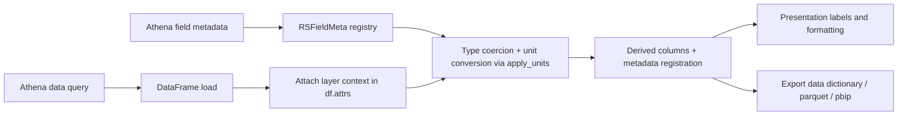

# Metadata and Units Architecture (Lightweight)

## Purpose

This document defines how report data should flow from Athena through metadata and unit handling into final presentation and exports.

It is intentionally lightweight and implementation-oriented:

- It captures current legacy patterns still in use.
- It defines the target pattern for new reports and refactors.
- It points to concrete examples in existing code.

## Scope

In scope:

- Athena metadata retrieval
- Metadata registration and layer scoping
- Unit conversion and display unit policy
- Derived-column metadata (for calculated columns and bins)
- Presentation/output labeling (charts, tables, data dictionary, PBIP)

Out of scope:

- UI styling details
- Athena SQL design conventions
- Cloud deployment mechanics

## High-Level Data Flow

## Legacy Pattern (Still Present)

Characteristics:

- Metadata is globally shared via the RSFieldMeta Borg singleton.
- Some reports perform only minimal metadata setup.
- Figure labels may be hardcoded strings instead of metadata-driven headers.

Example references:

- Global metadata registry design: [src/util/pandas/RSFieldMeta.py](../src/util/pandas/RSFieldMeta.py)
- Downstream geomorphic minimal metadata bootstrap: [src/reports/rpt_downstream_geomorphic/main.py#L39](../src/reports/rpt_downstream_geomorphic/main.py#L39)
- Downstream geomorphic hardcoded chart labels: [src/reports/rpt_downstream_geomorphic/figures.py#L16](../src/reports/rpt_downstream_geomorphic/figures.py#L16)

Risks:

- Ambiguous column metadata lookup when layer context is missing.
- Inconsistent friendly names/units across reports.
- Presentation text drift from metadata source of truth.

## Target Pattern

### 1) Retrieve metadata from Athena once per report run

- Load metadata records from layer_definitions_latest.
- Normalize any report-specific layer/name conventions.
- Set unit_system before conversion.

Examples:

- Metadata fetch API: [src/util/athena/athena.py#L259](../src/util/athena/athena.py#L259)
- Data Mart metadata normalization and display-unit overrides: [src/reports/rpt_data_mart/main.py#L212](../src/reports/rpt_data_mart/main.py#L212)

### 2) Keep layer context with each dataframe

- Set df.attrs["layer_id"] as soon as a dataframe is materialized.
- Use attrs-based layer resolution in conversion/export functions.

Examples:

- Layer context resolver: [src/util/pandas/RSFieldMeta.py#L715](../src/util/pandas/RSFieldMeta.py#L715)
- Data Mart layer assignment before apply_units: [src/reports/rpt_data_mart/main.py#L427](../src/reports/rpt_data_mart/main.py#L427)

### 3) Apply units and dtype coercion before presentation/export

- Run apply_units once the dataframe schema is stable for that stage.
- Preserve applied units as explicit sidecar data for export/provenance.

Examples:

- Unit and dtype application: [src/util/pandas/RSFieldMeta.py#L727](../src/util/pandas/RSFieldMeta.py#L727)
- Capturing per-table applied_units in Data Mart: [src/reports/rpt_data_mart/main.py#L421](../src/reports/rpt_data_mart/main.py#L421)

### 4) Register metadata for derived columns at creation time

- Any calculated, binned, or reshaped output column should get metadata immediately.
- Preserve parent theme/folder semantics where possible.

Examples:

- Bin augmentation + metadata registration: [src/util/rme/rme_common_dataprep.py#L192](../src/util/rme/rme_common_dataprep.py#L192)
- Theme inheritance for derived bin columns: [src/util/rme/rme_common_dataprep.py#L248](../src/util/rme/rme_common_dataprep.py#L248)
- Additional report-local derived metadata examples: [src/reports/rpt_watershed_summary/figures.py#L36](../src/reports/rpt_watershed_summary/figures.py#L36)

### 5) Drive outputs from metadata-aware structures

- For tabular exports, emit a data dictionary including friendly names, descriptions, units, formats, and theme.
- For chart/table presentation, prefer metadata-based headers/labels over hardcoded strings.

Examples:

- Data dictionary schema and export pipeline: [src/util/metadata_export.py#L135](../src/util/metadata_export.py#L135)
- TableEntry sidecar pattern (df + applied_units): [src/util/metadata_export.py#L22](../src/util/metadata_export.py#L22)
- Data Mart dictionary generation call: [src/reports/rpt_data_mart/main.py#L552](../src/reports/rpt_data_mart/main.py#L552)
- Metadata export tests: [tests/test_apply_all_bins.py#L122](../tests/test_apply_all_bins.py#L122)

## Transitional Strategy (Current Recommendation)

Near term:

- Keep RSFieldMeta as the authoritative registry for lookups and formatting.
- Require df.attrs["layer_id"] on every dataframe entering conversion/export.
- Carry per-dataframe applied_units in sidecars (TableEntry) for output provenance.

Longer term:

- Move toward DataFrame-local metadata payloads (attrs) containing both field metadata and applied units.
- Reduce dependence on global singleton state for downstream consumers.

Reference design note:

- [.github/prompts/plan-pbiSemanticModelAutomation.prompt.md](../.github/prompts/plan-pbiSemanticModelAutomation.prompt.md)

## Checklist for New or Refactored Reports

- Load field metadata via get_field_metadata early in orchestrate/main.
- Set RSFieldMeta.unit_system from CLI/env selection.
- Assign df.attrs["layer_id"] for each dataframe.
- Run apply_units before presentation or dictionary export.
- Register metadata for every derived column.
- Use metadata-based names/units in output labels; rely on RSFieldMeta fallback helpers instead of hardcoded label maps.
- Add or update tests validating metadata-aware outputs.

## Known Gap: Downstream Geomorphic (Current)

Current state:

- Metadata is loaded in define_fields, but plot labels are mostly hardcoded and not yet metadata-driven.

Primary references:

- Metadata setup entrypoint: [src/reports/rpt_downstream_geomorphic/main.py#L39](../src/reports/rpt_downstream_geomorphic/main.py#L39)
- Current chart-label implementation: [src/reports/rpt_downstream_geomorphic/figures.py#L79](../src/reports/rpt_downstream_geomorphic/figures.py#L79)

Recommended next step:

- Refactor downstream geomorphic figure builders to use RSFieldMeta headers/friendly names and resolved display units when constructing axis labels and titles.

Companion implementation prompt:

- [.github/prompts/implement-rpt-downstream-geomorphic-metadata.prompt.md](../.github/prompts/implement-rpt-downstream-geomorphic-metadata.prompt.md)
